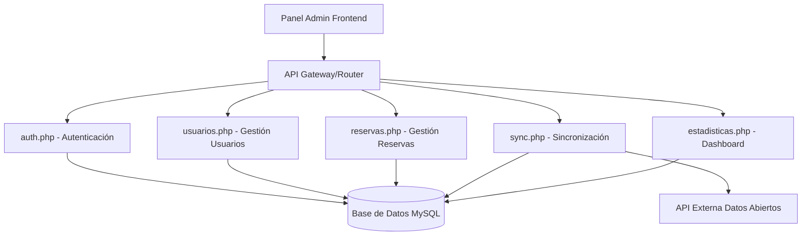
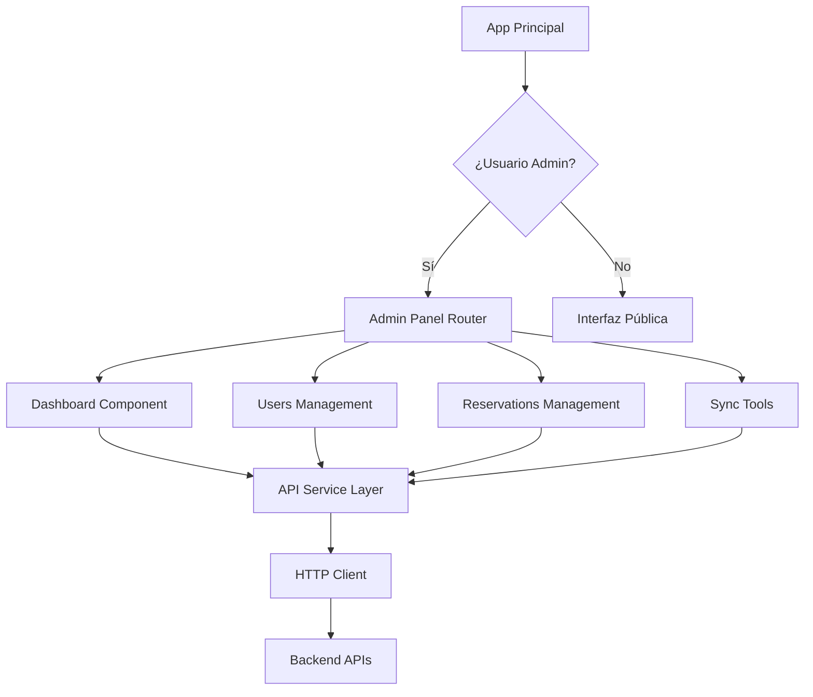

# Documento de Diseño: Panel de Administrador

## Visión General

El panel de administrador será una aplicación web frontend que se integra con el sistema existente de apartamentos turísticos. Proporcionará una interfaz completa para que los usuarios con rol 'admin' gestionen usuarios, reservas, ejecuten sincronizaciones y visualicen estadísticas del sistema.

La implementación se basará en el stack tecnológico existente del frontend, integrándose con las APIs REST ya disponibles en el backend PHP.

## Arquitectura

### Arquitectura General



### Arquitectura Frontend



## Componentes e Interfaces

### 1. Servicio de Autenticación Admin (AdminAuthService)

**Responsabilidad**: Gestionar la autenticación y autorización específica para administradores.

**Interfaz**:
```javascript
class AdminAuthService {
  async checkAdminAccess(): Promise<boolean>
  async getCurrentAdminUser(): Promise<AdminUser>
  redirectToLogin(): void
  setupAdminGuard(): void
}
```

**Integración**: Se conecta con `auth.php` para verificar el rol 'admin' del usuario autenticado.

### 2. Servicio de API Admin (AdminApiService)

**Responsabilidad**: Centralizar todas las llamadas a las APIs del backend para funcionalidades administrativas.

**Interfaz**:
```javascript
class AdminApiService {
  // Usuarios
  async getAllUsers(): Promise<User[]>
  async updateUserStatus(userId: number, status: string): Promise<void>
  async deleteUser(userId: number): Promise<void>
  
  // Reservas
  async getAllReservations(): Promise<Reservation[]>
  async updateReservationStatus(reservationId: number, status: string): Promise<void>
  
  // Estadísticas
  async getDashboardStats(): Promise<DashboardStats>
  
  // Sincronización
  async triggerSync(): Promise<SyncResult>
  async getSyncHistory(): Promise<SyncHistory[]>
}
```

### 3. Componente Dashboard

**Responsabilidad**: Mostrar estadísticas generales y métricas del sistema.

**Interfaz**:
```javascript
interface DashboardProps {
  refreshInterval?: number;
}

interface DashboardStats {
  totalUsers: number;
  usersByRole: { [role: string]: number };
  reservationsByStatus: { [status: string]: number };
  apartmentOccupancy: number;
  lastSyncDate: Date;
}
```

### 4. Componente de Gestión de Usuarios (UserManagement)

**Responsabilidad**: Listar, filtrar y gestionar usuarios del sistema.

**Interfaz**:
```javascript
interface UserManagementProps {
  onUserAction: (action: string, userId: number) => void;
}

interface User {
  id: number;
  email: string;
  role: string;
  status: 'active' | 'inactive';
  registrationDate: Date;
}
```

### 5. Componente de Gestión de Reservas (ReservationManagement)

**Responsabilidad**: Listar, filtrar y gestionar reservas del sistema.

**Interfaz**:
```javascript
interface ReservationManagementProps {
  onReservationAction: (action: string, reservationId: number) => void;
}

interface Reservation {
  id: number;
  userId: number;
  apartmentId: number;
  userEmail: string;
  apartmentName: string;
  checkIn: Date;
  checkOut: Date;
  status: 'pending' | 'confirmed' | 'cancelled' | 'completed';
  amount: number;
  createdAt: Date;
}
```

### 6. Componente de Herramientas de Sincronización (SyncTools)

**Responsabilidad**: Ejecutar y monitorear procesos de sincronización con APIs externas.

**Interfaz**:
```javascript
interface SyncToolsProps {
  onSyncComplete: (result: SyncResult) => void;
}

interface SyncResult {
  success: boolean;
  message: string;
  updatedRecords: number;
  errors?: string[];
  timestamp: Date;
}
```

## Modelos de Datos

### Usuario Admin
```javascript
interface AdminUser {
  id: number;
  email: string;
  role: 'admin';
  permissions: string[];
  lastLogin: Date;
}
```

### Estadísticas del Dashboard
```javascript
interface DashboardStats {
  users: {
    total: number;
    active: number;
    inactive: number;
    byRole: { [role: string]: number };
  };
  reservations: {
    total: number;
    byStatus: { [status: string]: number };
    thisMonth: number;
    revenue: number;
  };
  apartments: {
    total: number;
    occupied: number;
    occupancyRate: number;
  };
  sync: {
    lastSync: Date;
    status: 'success' | 'error' | 'pending';
    nextScheduled?: Date;
  };
}
```

### Filtros y Búsqueda
```javascript
interface UserFilters {
  role?: string;
  status?: 'active' | 'inactive';
  email?: string;
  dateFrom?: Date;
  dateTo?: Date;
}

interface ReservationFilters {
  status?: string;
  userId?: number;
  apartmentId?: number;
  dateFrom?: Date;
  dateTo?: Date;
  userEmail?: string;
}
```

## Correctness Properties

*Una propiedad es una característica o comportamiento que debe mantenerse verdadero en todas las ejecuciones válidas de un sistema - esencialmente, una declaración formal sobre lo que el sistema debe hacer. Las propiedades sirven como puente entre las especificaciones legibles por humanos y las garantías de corrección verificables por máquinas.*

Basándome en el análisis de prework completado, las siguientes propiedades de corrección han sido identificadas y consolidadas para eliminar redundancias:

### Propiedad 1: Control de Acceso Administrativo
*Para cualquier* usuario del sistema, el acceso al Panel_Admin debe estar permitido si y solo si el usuario tiene rol 'admin' y está autenticado, y debe verificarse en cada navegación
**Valida: Requerimientos 1.1, 1.2, 1.3, 1.4**

### Propiedad 2: Completitud del Dashboard
*Para cualquier* carga del dashboard, debe mostrarse el número total de usuarios, reservas por estado, estadísticas de ocupación y elementos gráficos visuales
**Valida: Requerimientos 2.1, 2.2, 2.3, 2.5**

### Propiedad 3: Actualización Automática del Dashboard
*Para cualquier* dashboard activo, las estadísticas deben actualizarse automáticamente cada 5 minutos
**Valida: Requerimientos 2.4**

### Propiedad 4: Completitud de Datos de Usuario
*Para cualquier* lista de usuarios mostrada, cada usuario debe incluir email, rol, estado y fecha de registro
**Valida: Requerimientos 3.1, 3.2**

### Propiedad 5: Gestión de Estado de Usuario
*Para cualquier* usuario seleccionado por un administrador, debe permitirse cambiar entre estados activo/inactivo y eliminar permanentemente tras confirmación
**Valida: Requerimientos 3.3, 3.4**

### Propiedad 6: Completitud de Datos de Reserva
*Para cualquier* lista de reservas mostrada, cada reserva debe incluir información del usuario, apartamento, fechas, estado y monto
**Valida: Requerimientos 4.1, 4.2**

### Propiedad 7: Gestión de Estado de Reserva
*Para cualquier* reserva seleccionada por un administrador, debe permitirse cambiar entre todos los estados válidos (pendiente, confirmada, cancelada, completada)
**Valida: Requerimientos 4.3**

### Propiedad 8: Funcionalidad de Filtros
*Para cualquier* combinación de criterios de filtro aplicada a usuarios o reservas, los resultados deben incluir únicamente elementos que cumplan todos los criterios especificados
**Valida: Requerimientos 3.5, 4.4**

### Propiedad 9: Ordenamiento por Defecto de Reservas
*Para cualquier* lista de reservas mostrada sin ordenamiento específico, debe estar ordenada por fecha de creación en orden descendente
**Valida: Requerimientos 4.6**

### Propiedad 10: Estado de Sincronización
*Para cualquier* acceso a herramientas de sincronización, debe mostrarse el estado de la última sincronización ejecutada
**Valida: Requerimientos 5.1**

### Propiedad 11: Ejecución y Progreso de Sincronización
*Para cualquier* sincronización manual iniciada, debe ejecutarse el proceso y mostrar progreso en tiempo real hasta completarse
**Valida: Requerimientos 5.2**

### Propiedad 12: Resultado de Sincronización
*Para cualquier* sincronización completada o fallida, debe mostrarse un resumen de resultados o errores específicos con sugerencias
**Valida: Requerimientos 5.3, 5.4**

### Propiedad 13: Historial de Sincronización
*Para cualquier* historial de sincronizaciones, debe mantener exactamente las últimas 10 ejecuciones registradas
**Valida: Requerimientos 5.5**

### Propiedad 14: Responsividad de Interfaz
*Para cualquier* tamaño de pantalla (móvil, tablet, desktop), el Panel_Admin debe ser completamente funcional y responsive
**Valida: Requerimientos 6.1**

### Propiedad 15: Navegación y Estado Activo
*Para cualquier* navegación en el Panel_Admin, debe mostrarse un menú completo con la sección actual resaltada visualmente
**Valida: Requerimientos 6.2, 6.3**

### Propiedad 16: Feedback Visual de Acciones
*Para cualquier* acción realizada en el sistema (cambios de usuario, reserva, sincronización), debe proporcionarse feedback visual inmediato y confirmación
**Valida: Requerimientos 3.6, 4.5, 6.5**

### Propiedad 17: Confirmación de Acciones Destructivas
*Para cualquier* acción destructiva (eliminar usuario, cancelar reserva), debe solicitarse confirmación explícita antes de ejecutar
**Valida: Requerimientos 7.1**

### Propiedad 18: Validación de Datos
*Para cualquier* envío de datos al backend, todos los campos deben validarse antes del envío
**Valida: Requerimientos 7.2**

### Propiedad 19: Manejo de Sesión Expirada
*Para cualquier* sesión de administrador que expire, debe redirigirse automáticamente al login
**Valida: Requerimientos 7.3**

### Propiedad 20: Manejo de Errores de API
*Para cualquier* error de API que ocurra, debe mostrarse un mensaje de error claro y específico
**Valida: Requerimientos 7.4**

### Propiedad 21: Auditoría de Acciones
*Para cualquier* acción administrativa realizada, debe registrarse para propósitos de auditoría
**Valida: Requerimientos 7.5**

## Manejo de Errores

### Estrategia de Manejo de Errores

1. **Errores de Autenticación**:
   - Sesión expirada: Redirección automática al login
   - Acceso denegado: Mensaje claro y redirección a página principal
   - Token inválido: Limpieza de sesión y redirección al login

2. **Errores de API**:
   - Timeout: Reintento automático con backoff exponencial
   - 500 Server Error: Mensaje genérico de error del servidor
   - 404 Not Found: Mensaje específico de recurso no encontrado
   - 403 Forbidden: Mensaje de permisos insuficientes

3. **Errores de Validación**:
   - Campos requeridos: Resaltado visual y mensaje específico
   - Formato inválido: Mensaje de formato esperado
   - Valores fuera de rango: Mensaje con rango válido

4. **Errores de Red**:
   - Sin conexión: Mensaje de verificar conectividad
   - Respuesta lenta: Indicador de carga con opción de cancelar

### Códigos de Error Específicos

```javascript
const ERROR_CODES = {
  AUTH_EXPIRED: 'AUTH_001',
  ACCESS_DENIED: 'AUTH_002',
  INVALID_TOKEN: 'AUTH_003',
  SERVER_ERROR: 'API_001',
  NETWORK_ERROR: 'NET_001',
  VALIDATION_ERROR: 'VAL_001',
  SYNC_FAILED: 'SYNC_001'
};
```

## Estrategia de Testing

### Enfoque Dual de Testing

El sistema implementará tanto **pruebas unitarias** como **pruebas basadas en propiedades** para garantizar cobertura completa:

- **Pruebas unitarias**: Verifican ejemplos específicos, casos límite y condiciones de error
- **Pruebas basadas en propiedades**: Verifican propiedades universales a través de múltiples entradas generadas

### Configuración de Pruebas Basadas en Propiedades

- **Biblioteca**: Se utilizará **fast-check** para JavaScript/TypeScript
- **Iteraciones mínimas**: 100 iteraciones por prueba de propiedad
- **Etiquetado**: Cada prueba debe referenciar su propiedad de diseño correspondiente
- **Formato de etiqueta**: `Feature: admin-panel, Property {número}: {texto de propiedad}`

### Distribución de Pruebas

**Pruebas Unitarias se enfocarán en**:
- Ejemplos específicos de comportamiento correcto
- Casos límite y condiciones de error
- Puntos de integración entre componentes
- Validaciones de formularios con datos específicos

**Pruebas de Propiedades se enfocarán en**:
- Propiedades universales que se mantienen para todas las entradas
- Cobertura exhaustiva de entradas a través de generación aleatoria
- Invariantes del sistema que deben mantenerse siempre
- Comportamientos que deben ser consistentes independientemente de los datos

### Ejemplos de Configuración de Pruebas

```javascript
// Prueba de Propiedad - Ejemplo
describe('Admin Panel Properties', () => {
  it('Property 1: Admin access control', () => {
    // Feature: admin-panel, Property 1: Control de Acceso Administrativo
    fc.assert(fc.property(
      fc.record({
        role: fc.oneof(fc.constant('admin'), fc.constant('user')),
        authenticated: fc.boolean()
      }),
      (user) => {
        const hasAccess = checkAdminAccess(user);
        return hasAccess === (user.role === 'admin' && user.authenticated);
      }
    ), { numRuns: 100 });
  });
});

// Prueba Unitaria - Ejemplo
describe('Dashboard Component', () => {
  it('should display error message when API fails', async () => {
    // Caso específico de error
    mockApiService.getDashboardStats.mockRejectedValue(new Error('API Error'));
    render(<Dashboard />);
    await waitFor(() => {
      expect(screen.getByText(/error loading statistics/i)).toBeInTheDocument();
    });
  });
});
```

### Cobertura de Testing

- **Cobertura de código**: Mínimo 85% para componentes críticos
- **Cobertura de propiedades**: Todas las 21 propiedades identificadas deben tener pruebas correspondientes
- **Pruebas de integración**: Flujos completos de usuario para cada funcionalidad principal
- **Pruebas de accesibilidad**: Verificación de estándares WCAG 2.1 AA